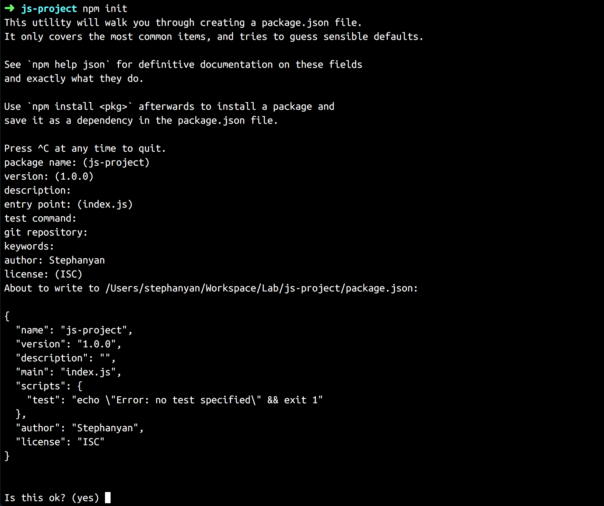
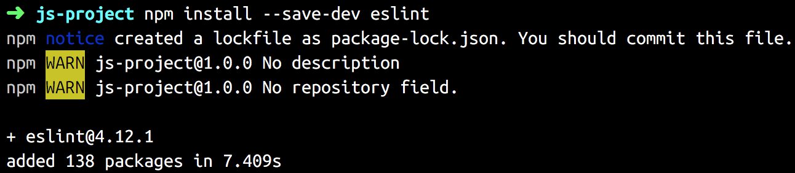
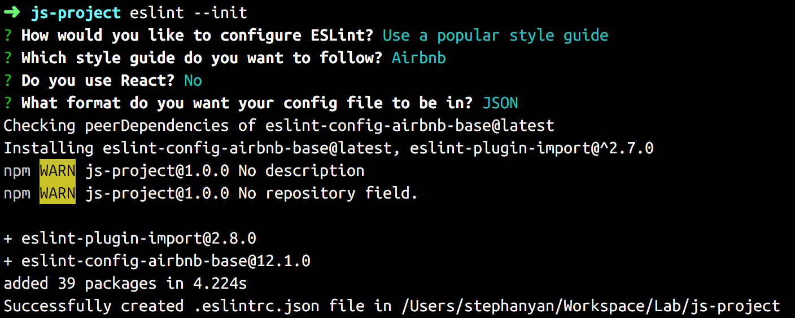
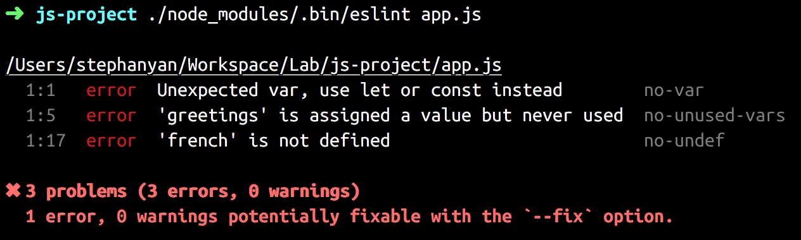
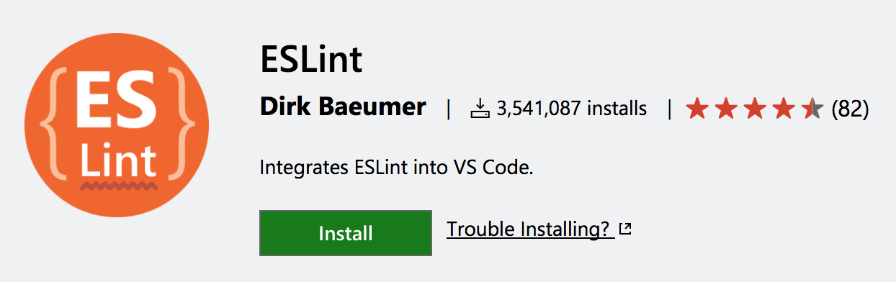
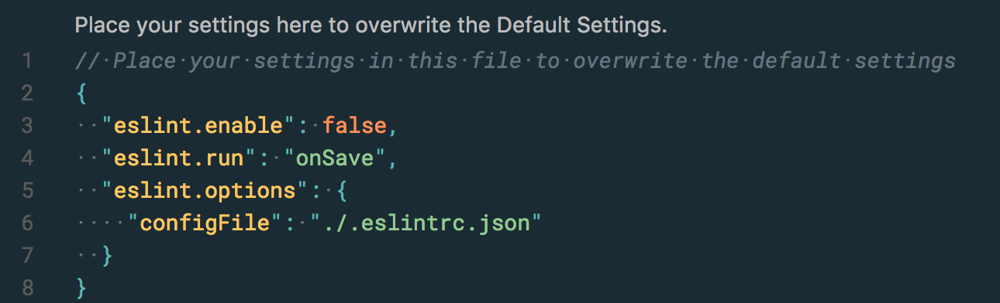
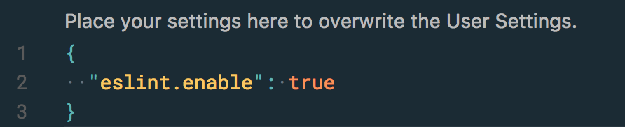

## How I setup ESLint in a project

> Disclaimer: I originally wrote this guide for myself because my brain has not been designed to memorise all these details. It is possible that this guide does not suit your case. 

1. You will need a package.json file to manage all dependencies that ESLint (and other packages) needs.
If you have not already done so, run `npm init` in the root of your project like so: (skip steps you don't need)

2. You can now install ESLint locally: `npm install --save-dev eslint`

3. To configure ESLint, you will need a .eslintrc file. I personnally generate this file with `eslint --init` to use the airbnb style guide like so:

4. To test ESLint, run `./node_modules/.bin/eslint` in your project (or on any JavaScript file you want to analyse) like so:

It works! Everything is fine :)

## ESLint with Visual Studio Code

> If you don't get the same results sometimes you may need to reload the window or simply relaunch Visual Studio Code. Don't hesitate to open an issue if necessary.

1. Install the [ESLint extension](https://marketplace.visualstudio.com/items?itemName=dbaeumer.vscode-eslint) for Visual Studio Code:

2. "eslint.enable:" is enabled by default in your default settings. However, you don't always need ESLint. You still can disable it globally in your editor, like I did, by setting `false`:

- `"eslint.run": "onSave"` runs the linter only on save.
- `"eslint.options": { "configFile": "./.eslintrc.json" }` indicate to VS Code where the .eslintrc.json file is usually located (you need this block of lines to prevent errors).

3. If you want to use ESLint, you will now need to enable it in your workspace settings by adding:

Et voilà ! You can now see ESLint magics directly in your editor.
